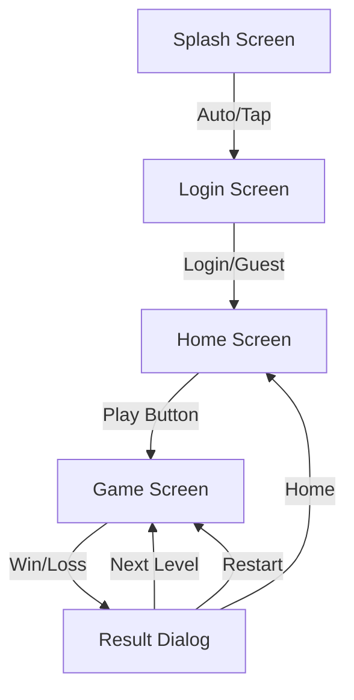

# Brick Blast: Master Design Document

This document consolidates the Product Requirements, User Flow, and Game Mechanics for Brick Blast.

---

## Part 1: Product Requirements Document (PRD)

### 1. Introduction
Brick Blast is a turn-based, ball-shooter puzzle game where players aim and fire a stream of balls to break bricks that descend from the top of the screen. The game emphasizes strategic aiming, physics-based deflections, and long-term progression through levels.

### 2. Goals & Objectives
- **Core Loop**: Provide a satisfying, deterministic "aim-fire-resolve" loop.
- **Progression**: Offer players a sense of advancement through levels, difficulty scaling, and a coin economy.
- **Retention**: Engage players with variations in level types (Standard, Endurance, Blitz) and boss encounters.
- **Monetization (Future)**: Foundation for ads and in-app purchases.

### 3. Target Audience
- Casual mobile gamers who enjoy puzzle/arcade games.
- Players seeking short, engaging sessions with clear goals.

### 4. Key Features

#### 4.1 Gameplay
- **Turn-Based Action**: Players take their time to aim; the game state updates only after firing.
- **Ball Stream**: A single fire action releases a stream of balls (based on `ballCount`).
- **Physics**: Custom deterministic physics engine ensures consistent behavior for aims and bounces.
- **Brick Mechanics**: Bricks have HP and take damage on collision. They move down one row after each turn.
- **Game Over**: The game ends if a brick reaches the bottom row (launcher level).

#### 4.2 Level System
- **Structured Levels**: Distinct levels with specific configurations vs infinite runners.
- **Waves**: Each level consists of multiple "waves" of bricks spawning.
- **Cleanup Phase**: After the final wave spawns, no new bricks appear ("Cleanup Phase"). The level ends when all bricks are cleared.
- **Boss Waves**: The final wave of a level is a "Boss Wave" with higher HP or distinct patterns.
- **Level Types**:
    - **Standard**: Balanced difficulty (e.g., 10 waves).
    - **Endurance**: Longer levels (e.g., 20 waves) testing consistency.
    - **Blitz**: Shorter, high-intensity levels (e.g., 5 waves) with 2x damage multiplier.

#### 4.3 Economy & Scoring
- **Score**: Points are awarded for damage dealt to bricks (10 points per 1 HP damage).
- **Coins**:
    - Earned by clearing levels.
    - Rate: 1 Coin per 100 Score.
    - Payout is strictly on level completion (no coins for failure).
    - Global "buckets" system ensures coins are paid out fairly based on total score accumulation.

### 5. User Interface (UI) Requirements
- **Splash Screen**: Branding entry point.
- **Login Screen**: Simple entry / Guest access.
- **Home Screen**:
    - "Play" button.
    - Stats display (Best Score, Highest Level, Total Coins).
- **Game Screen**:
    - **Top Bar**: Score, Level progress, Coin count.
    - **Play Area**: Brick grid, Launcher, Ball stream.
    - **HUD**: Aiming guide (trajectory line).
    - **Dialogs**:
        - Level Complete (Coins earned).
        - Game Over (Score summary, Restart option).

---

## Part 2: User Flow

### 1. High-Level Flow
The primary user journey follows a linear path from app launch to gameplay.

### 2. Detailed Flow Stages

#### 2.1 Onboarding / Entry
1.  **Splash Module**: Initializes app resources.
    - *Action*: Automatically navigates to Login after delay or resource load.
2.  **Login Module**: Authenticates the user.
    - *Action*: User selects "Guest" or enters credentials (planned).
    - *Outcome*: Navigates to Home Screen.

#### 2.2 Home / Meta-Game
1.  **Home Screen**: Hub for progression.
    - *Display*: Current Level, Best Score, Total Coins.
    - *Interaction*: User taps "Play".
    - *Outcome*: Launches `GameScreen` with the current saved level progress.

#### 2.3 Core Gameplay Loop
1.  **Idle Phase**:
    - User assesses the board.
    - Input: Touch and drag to aim.
2.  **Aiming Phase**:
    - System draws a trajectory line showing the ball's path.
    - Input: Release touch to fire.
3.  **Firing Phase**:
    - Launcher releases a stream of balls.
    - Input: Locked (user cannot interact).
4.  **Simulation Phase**:
    - Balls bounce, hit bricks, and deal damage.
    - Balls return to the floor.
5.  **Turn Resolution**:
    - All balls return to the floor (launcher moves to the first ball's landing spot).
    - Bricks shift down one row.
    - New wave spawns (if applicable).
    - Check for Game Over (Bricks at bottom).

#### 2.4 End of Session (Level)
1.  **Level Complete**:
    - *Condition*: All bricks cleared.
    - *Display*: "Level Complete" dialog.
    - *Rewards*: Coins awarded based on score.
    - *Actions*: "Next Level" (continues game) or "Home".
2.  **Game Over**:
    - *Condition*: A brick reaches the launcher row.
    - *Display*: "Game Over" dialog with Score and Best Score.
    - *Rewards*: None (Coins are only for level completion).
    - *Actions*: "Restart" (Restart level 1 or saved checkpoint) or "Home".

---

## Part 3: Game Mechanics & Technical Explanation

This section explains "how it works" under the hood, detailing the systems driving Brick Blast.

### 1. Architecture Overview
The game uses a modular architecture with a clean separation of concerns:
- **GameController**: The "brain" managing state, user input, and coordinating other services.
- **SimulationEngine**: The "physics" layer handling movement, collisions, and deterministic updates.
- **LevelProgressionService**: Controls the rules for waves, level types, and difficulty.

### 2. Core Loop & State Machine
The game operates on a strict **Phase Machine** defined in `GamePhase`:

| Phase | Description | Inputs Allowed |
| :--- | :--- | :--- |
| **Idle** | Waiting for user input. | Aiming |
| **Aiming** | User is dragging; trajectory is shown. | Release to Fire |
| **Firing** | Balls are being ejected from the launcher queue. | None (Locked) |
| **Busy** | Balls are active in the field (bouncing/hitting). | None (Locked) |
| **EndTurn** | All balls have returned. Board shifts, new wave spawns. | None (Locked) |
| **GameOver** | Defeat state. Dialog shown. | Restart / Exit |

### 3. Physics Engine (`SimulationEngine`)
Functionality is custom-built for predictability (Deterministic).
- **Collision Detection**:
    - **Circle-AABB**: Used for Ball vs. Brick.
    - **Reflection**: Velocity vector is reflected based on the side of the brick hit.
    - **Tunneling Prevention**: Includes look-ahead steps to prevent fast balls from skipping through bricks.
- **Bouncing**:
    - Perfect elastic collisions with walls.
    - Specific logic for "corner hits" to prevent getting stuck.

### 4. Level Progression Logic
Managed by `LevelProgressionService` and `LevelPlanBuilder`.
- **Level Types**:
    - **Standard**: Default pace.
    - **Endurance**: More waves.
    - **Blitz**: Fewer waves, **2x Damage Multiplier**.
- **Waves & Patterns**:
    - Waves follow patterns: `Random`, `Checkerboard`, `Pillars`, `Wall`.
    - **Boss Wave**: The final wave of a level.
    - **Cleanup Phase**: After the Boss Wave, no new bricks spawn.

### 5. Coin Economy
- **Philosophy**: Reward *completion*.
- **Mechanism**: Coins = $Score / 100$.
- **Payout Trigger**: Coins are only permanently added to `TotalCoins` when the level is **completed**.
- **Storage**: Currently in-memory (requires persistence update).

